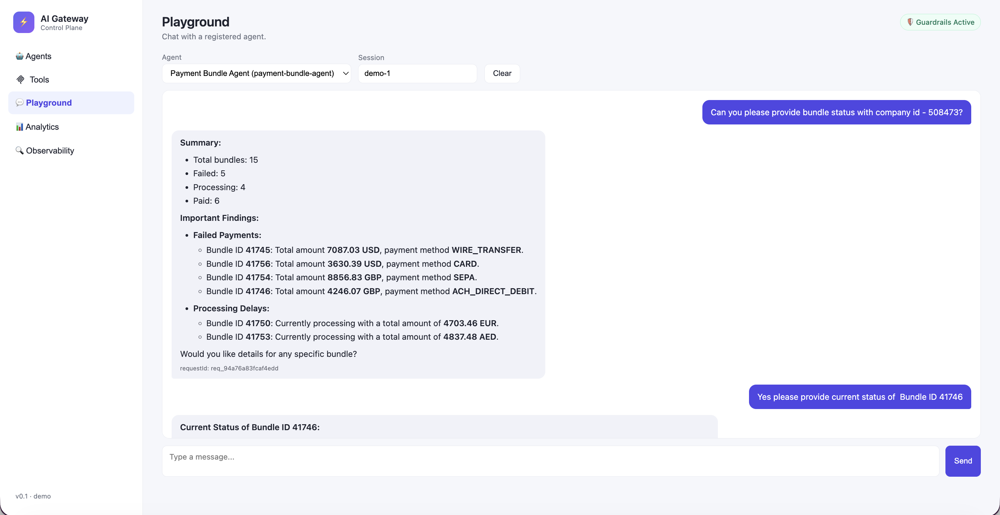
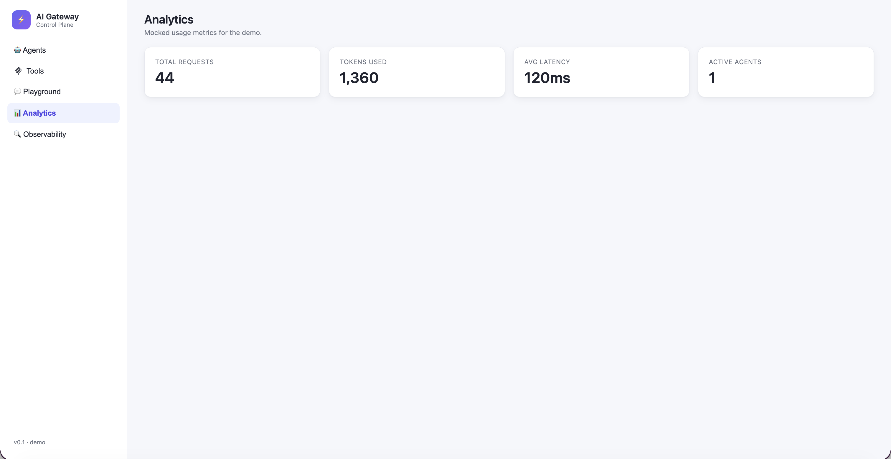

# AI Gateway Service

A Spring Boot service that acts as a vendor-agnostic AI gateway, exposing a unified REST API for LLM interactions, dynamic tool registration, and autonomous agent execution via an iterative LLM→tool→LLM loop.

## Overview

The service provides three core capabilities:

- **LLM Proxy** — A thin, provider-agnostic layer over OpenAI-compatible chat completions with request tracking, latency logging, and automatic retry.
- **Tool Registry** — A runtime HTTP-based tool registry. Tools are registered with a name, URL, HTTP method, and parameter schema. The LLM can discover and invoke these tools at runtime.
- **Agent Engine** — Stateful agents that combine a system prompt, a set of registered tools, and an iterative execution loop (up to 5 LLM↔tool roundtrips per request). Sessions are supported via in-memory conversation history.

A bundled vanilla-JS frontend is served at `http://localhost:8095` and provides views for managing agents, tools, running playground conversations, and a basic observability log.

## Demo

**Playground** — chat with a registered agent in real time. The agent runs an iterative tool-call loop and streams the final answer back.



**Analytics** — at-a-glance usage metrics: total requests, tokens used, average latency, and active agent count.



## Tech Stack

| Layer | Technology |
|---|---|
| Runtime | Java 17 |
| Framework | Spring Boot 3.2.0 |
| Build | Gradle 8.12 (Groovy DSL) |
| LLM Provider | OpenAI (gpt-4o-mini default; any `gpt-*`, `o1*`, `o3*` model) |
| Serialization | Jackson (via Spring Web) |
| Boilerplate | Lombok |
| Tests | JUnit Jupiter 5.10 |

## Project Structure

```
src/main/java/com/aigateway/
├── AiGatewayApplication.java       # Spring Boot entry point
├── agent/
│   ├── AgentEngine.java            # LLM→tool iterative loop (max 5 iterations)
│   ├── AgentRegistry.java          # In-memory agent store (ConcurrentHashMap)
│   ├── AgentService.java           # Orchestrates registry + engine + session memory
│   └── SessionMemory.java          # Per-session conversation history (max 15 messages)
├── config/
│   ├── OpenAIProperties.java       # Binds aigateway.llm.openai.* from application.yml
│   ├── RegistryProperties.java     # Binds aigateway.registry.seed-tools from config
│   ├── RestTemplateConfig.java     # RestTemplate with 10s connect / 60s read timeouts
│   └── WebConfig.java              # CORS config (localhost origins)
├── controller/
│   ├── AgentController.java        # /agents endpoints
│   ├── LLMController.java          # /llm/chat endpoint
│   └── ToolController.java         # /tools endpoints
├── llm/
│   ├── LLMService.java             # Facade: request-ID injection, latency log, 1 retry
│   ├── OpenAIClient.java           # Raw HTTP client for OpenAI chat completions
│   └── provider/
│       ├── LLMProvider.java        # Interface for adding new LLM providers
│       └── OpenAIProvider.java     # OpenAI implementation
├── model/                          # Request/response POJOs (Lombok @Data/@Builder)
├── registry/
│   └── ToolRegistry.java           # Thread-safe tool store, seeded from config at startup
├── tool/
│   ├── ToolInvoker.java            # Executes tool HTTP calls with LLM-generated arguments
│   └── HeaderResolver.java         # Resolves {{placeholder}} tokens in tool headers
└── util/
    └── RequestIdUtil.java          # Generates req_<uuid> request IDs

src/main/resources/
├── application.yml.example         # Safe config template (copy to application.yml)
└── static/                         # Bundled frontend (served at /)
    ├── index.html
    ├── app.js
    ├── styles.css
    └── diag.html
```

## Getting Started

### Prerequisites

- Java 17+
- An OpenAI API key

### Configuration

Copy the example config and fill in your credentials:

```bash
cp src/main/resources/application.yml.example src/main/resources/application.yml
```

Edit `application.yml` and set your OpenAI API key, or export it as an environment variable:

```bash
export OPENAI_API_KEY=sk-...
```

Key configuration options:

```yaml
server:
  port: 8095

aigateway:
  llm:
    openai:
      base-url: ${OPENAI_BASE_URL:https://api.openai.com/v1}
      api-key: ${OPENAI_API_KEY:your-key-here}
      timeout-ms: 30000
      default-model: gpt-4o-mini
  registry:
    seed-tools: []   # pre-load tools at startup
```

### Running

```bash
./gradlew bootRun
```

The service starts on port `8095`. Open `http://localhost:8095` for the UI.

## API Reference

### LLM

| Method | Path | Description |
|---|---|---|
| `POST` | `/llm/chat` | Send a chat completion request directly to the configured LLM |

**Request body** — OpenAI-style `LLMRequest`:
```json
{
  "model": "gpt-4o-mini",
  "messages": [
    { "role": "user", "content": "Hello!" }
  ]
}
```

### Tools

| Method | Path | Description |
|---|---|---|
| `GET` | `/tools` | List all registered tools |
| `GET` | `/tools/{name}` | Get a single tool by name |
| `POST` | `/tools/register` | Register a new tool |

**Register a tool:**
```json
{
  "name": "get_weather",
  "description": "Get current weather for a city",
  "url": "https://api.example.com/weather",
  "method": "GET",
  "parameters": {
    "type": "object",
    "properties": {
      "city": { "type": "string", "description": "City name" }
    },
    "required": ["city"]
  }
}
```

### Agents

| Method | Path | Description |
|---|---|---|
| `POST` | `/agents` | Create a new agent |
| `GET` | `/agents` | List all agents |
| `GET` | `/agents/{agentId}` | Get an agent by ID |
| `POST` | `/agents/run` | Run an agent with a user input |

**Create an agent:**
```json
{
  "agentId": "weather-bot",
  "model": "gpt-4o-mini",
  "systemPrompt": "You are a helpful weather assistant. Use the get_weather tool to answer questions.",
  "tools": ["get_weather"]
}
```

**Run an agent:**
```json
{
  "agentId": "weather-bot",
  "input": "What's the weather like in London?",
  "sessionId": "session-abc123",
  "context": {}
}
```

The `sessionId` is optional. When provided, conversation history is preserved across calls (up to 15 messages).

**Response:**
```json
{
  "response": "The current weather in London is 15°C and cloudy.",
  "requestId": "req_a1b2c3d4e5f6g7h8"
}
```

## Agent Execution Loop

```
User input
    │
    ▼
[System prompt + history + user message]
    │
    ▼
LLM call ──► No tool calls? ──► Return response
    │
    │  Tool calls present
    ▼
Execute each tool via HTTP
    │
    ▼
Append tool results to conversation
    │
    ▼
LLM call (next iteration, max 5)
```

## Adding a New LLM Provider

Implement the `LLMProvider` interface:

```java
@Component
public class MyProvider implements LLMProvider {
    @Override
    public boolean supports(String model) { return model.startsWith("my-model"); }

    @Override
    public LLMResponse chat(LLMRequest request) { /* ... */ }
}
```

`LLMService` auto-discovers all `LLMProvider` beans and routes by model name.

## Frontend

A built-in single-page app is served at `http://localhost:8095`:

- **Agents** — create and view agents
- **Tools** — register and browse tools
- **Playground** — interactive chat against any agent
- **Analytics / Observability** — in-browser request log

## License

Internal use — Multiplier.
